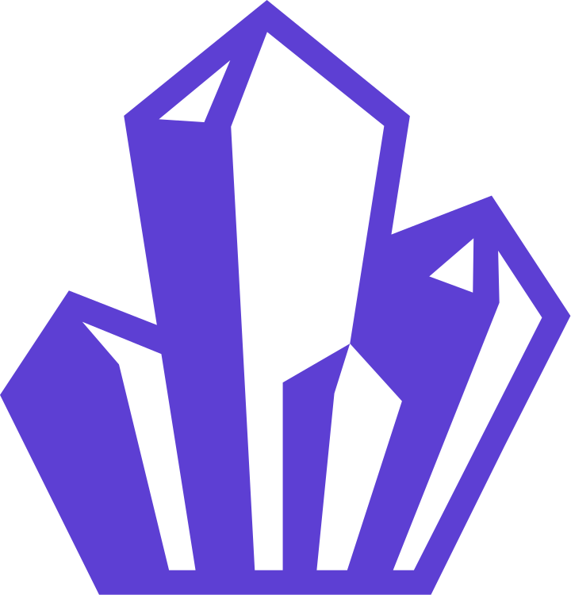
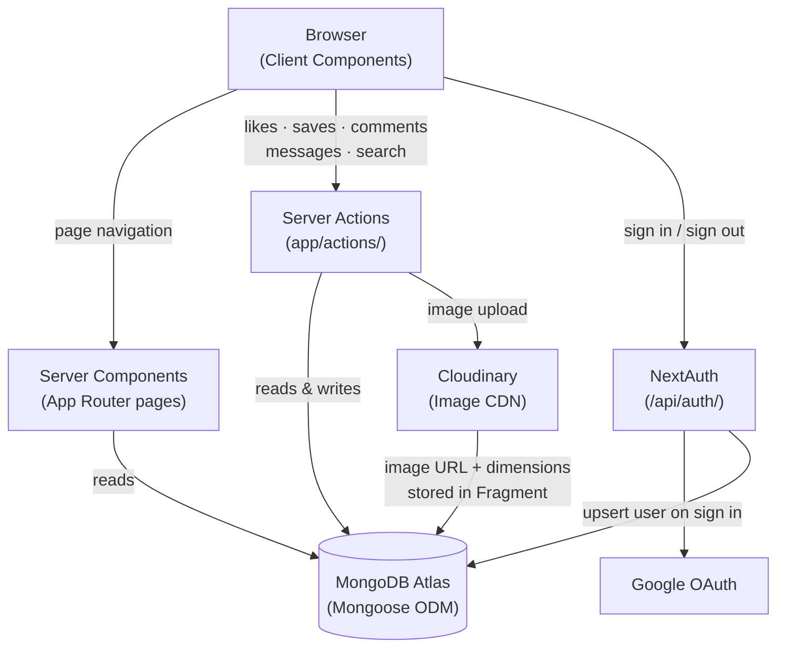

<div align="center">

# Crystal Clear

<p align="center">
  
</p>

### _A Visualization-Centric Social Media Platform_

<br />

[](https://nextjs.org/)
[](https://react.dev/)
[](https://tailwindcss.com/)
[](https://www.mongodb.com/)
[](https://cloudinary.com/)

<br />

**[Concept](#concept) • [Features](#features) • [Pages](#pages) • [Architecture](#architecture) • [Data Model](#data-model) • [Tech Stack](#tech-stack) • [Quick Start](#quick-start) • [Project Structure](#project-structure) • [Roadmap](#roadmap)**

<br />

</div>

---

<details>
<summary><b>Table of Contents</b></summary>

- [Concept](#concept)
- [Features](#features)
- [Pages](#pages)
- [Architecture](#architecture)
- [Data Model](#data-model)
- [Tech Stack](#tech-stack)
- [Quick Start](#quick-start)
  - [Prerequisites](#prerequisites)
  - [Environment Variables](#environment-variables)
  - [Installation](#installation)
  - [Production Build](#production-build)
- [Project Structure](#project-structure)
- [Scripts](#scripts)
- [Deployment](#deployment)
- [Roadmap](#roadmap)
- [Contributing](#contributing)
- [FAQ](#faq)

</details>

---

## Concept

**Crystal Clear** is a photography-first social platform built around a simple two-layer model: **Fragments** and **Crystals**.

A **Fragment** is a single photograph — the atomic unit of the platform. Every image a user uploads is a Fragment, carrying its own metadata: title, tags, description, location, and engagement metrics (likes, views).

A **Crystal** is a curated collection of Fragments. Where a Fragment is a moment, a Crystal is a narrative — a named, ordered set of images that a photographer assembles to tell a story or define a body of work.

This model keeps the feed open and exploratory while giving photographers a meaningful way to present cohesive work, not just individual shots.

<br />

<div align="center">
<table>
<tr>
<td align="center" width="25%">

### Upload Fragments

Photograph → upload → tag with location, description, and keywords. Your image lives as its own piece in the global feed.

</td>
<td align="center" width="25%">

### Curate Crystals

Group your Fragments into named collections. Control visibility — keep a Crystal private or share it with the world.

</td>
<td align="center" width="25%">

### Discover & Save

Browse an infinite masonry feed, explore featured collections, search by keyword, or dive into a photographer's profile. Save anything worth revisiting.

</td>
<td align="center" width="25%">

### Engage

Like and comment on Fragments, reply in threaded discussions, and message photographers directly. Reactions are real-time and optimistically updated.

</td>
</tr>
</table>
</div>

<br />

---

## Features

<div align="center">

|   Category    |      Feature      | Description                                                                    |
| :-----------: | :---------------: | :----------------------------------------------------------------------------- |
| **Discovery** |   Infinite Feed   | Cursor-paginated masonry feed of all Fragments, newest first                   |
| **Discovery** |   Explore Page    | Curated grid of Featured Crystals, updated daily                               |
| **Discovery** |      Search       | Full-text search across Fragment names, tags, and descriptions                 |
|  **Content**  |  Fragment Upload  | Upload photos via Cloudinary with title, tags, description, and location       |
|  **Content**  | Crystal Creation  | Compose named collections from your uploaded Fragments                         |
|  **Content**  |  Crystal Seeding  | Add individual Fragments to existing Crystals from the detail view             |
|   **Social**  |   Likes & Saves   | Like any Fragment; save Fragments and Crystals to your personal library        |
|   **Social**  | Threaded Comments | Nested comment threads on every Fragment with per-comment likes                |
|   **Social**  | Direct Messaging  | One-to-one conversation inbox between authenticated users                      |
|   **Social**  |   User Profiles   | Public profile pages showing a photographer's Crystals and Fragments           |
|  **Library**  | Personal Library  | Dashboard for your created and saved Fragments and Crystals                    |
|    **Auth**   |   Google OAuth    | Sign in with Google via NextAuth — no passwords, no friction                   |
|   **Search**  |  Query Recording  | Search queries are persisted for authenticated users, powering recommendations |
|   **Search**  |  Recommendations  | Related content and user suggestions built from recorded search behavior       |

</div>

<br />

---

## Pages

| Route                    | Description                                                                  |
| :----------------------- | :--------------------------------------------------------------------------- |
| `/`                      | Infinite masonry feed of all Fragments with intersection-observer pagination |
| `/explore`               | Featured Crystals displayed in a responsive grid gallery                     |
| `/fragment/[fragmentId]` | Full-detail Fragment view with a related Fragment feed below                 |
| `/crystal/[crystalId]`   | Masonry gallery of every Fragment inside a Crystal                           |
| `/search?q=...`          | Full-text search results across Fragments                                    |
| `/search?crystal=...`    | Browse all Fragments within a specific Crystal                               |
| `/library`               | Authenticated user's personal collection — created and saved content         |
| `/library/[crystalId]`   | Manage a specific Crystal: view, seed, or remove Fragments                   |
| `/profile/[profileId]`   | Public view of any user's created Crystals and Fragments                     |
| `/create/fragment`       | Upload and publish a new Fragment                                            |
| `/create/crystal`        | Create a new named Crystal                                                   |
| `/settings/*`            | About, features, developer info, and policy pages                            |

<br />

---

## Architecture

Crystal Clear is a full-stack Next.js application. Server Components handle data fetching directly from MongoDB, while Server Actions handle all mutations. The client layer is responsible only for interactivity — optimistic UI updates, intersection-observer pagination, and modal state.



### Key Design Decisions

**Server Components as the data layer.** Pages like `/explore`, `/crystal/[id]`, and `/library` are fully server-rendered — they connect to MongoDB directly, serialize documents, and pass plain objects to client components. This keeps the client bundle lean and eliminates redundant API routes for reads.

**Server Actions for all mutations.** Likes, saves, comments, messages, and Crystal membership changes all go through typed Server Actions (`app/actions/`). This avoids building a separate REST or GraphQL layer for write operations.

**Cursor-based pagination.** The home feed and fragment detail feed use `(createdAt, _id)` cursor pairs rather than offset pagination, which stays stable under concurrent inserts and avoids the performance cliff of large `.skip()` calls in MongoDB.

**Optimistic UI for engagement.** Like and save interactions update local React state immediately before the Server Action resolves, then reconcile with the server response. This makes the platform feel instant even under latency.

**Cloudinary as the image pipeline.** Uploads go through the Cloudinary SDK on the server side. The returned `url`, `width`, and `height` are stored on the Fragment document, so the masonry layout can compute aspect ratios without client-side image probing.

<br />

---

## Data Model

Ten Mongoose documents power the platform, organized around the Fragment/Crystal core with layered social features on top.

```
User
 ├── email, username, image
 └── saved { crystals[], fragments[] }

Fragment
 ├── ownerId → User
 ├── crystalId → Crystal          (optional primary Crystal)
 ├── name, tags[], description
 ├── location { street, city, region, country, postalCode }
 ├── image { url, width, height }
 ├── isFeatured
 └── likes, views                 (denormalized counts)

Crystal
 ├── ownerId → User
 ├── name, description
 ├── images[] → Fragment[]
 ├── isFeatured
 └── isPrivate

Like                              (User × Fragment join — prevents duplicate likes)
View                              (User × Fragment join — prevents duplicate views)

Thread                            (comment thread anchored to a Fragment)
Comment  →  Thread                (individual comment with author + body)
CommentLike                       (User × Comment join)

Conversation                      (User × User DM channel)
Message  →  Conversation          (individual message with sender + body)

Query                             (recorded search term per authenticated User)
```

<br />

---

## Tech Stack

<div align="center">

|       Layer       | Technology                                                                                                                                   |
| :---------------: | :------------------------------------------------------------------------------------------------------------------------------------------- |
|   **Framework**   | [Next.js 16](https://nextjs.org/) — App Router, Server Actions, Server Components                                                            |
|      **UI**       | [React 19](https://react.dev/) with [Tailwind CSS v4](https://tailwindcss.com/)                                                              |
|   **Database**    | [MongoDB](https://www.mongodb.com/) via [Mongoose 9](https://mongoosejs.com/)                                                                |
|     **Media**     | [Cloudinary](https://cloudinary.com/) — image upload, storage, and CDN delivery                                                             |
|     **Auth**      | [NextAuth v4](https://next-auth.js.org/) — Google OAuth provider                                                                             |
|     **Icons**     | [Lucide React](https://lucide.dev/), [Phosphor React](https://phosphoricons.com/), [React Icons](https://react-icons.github.io/react-icons/) |
| **Notifications** | [React Toastify](https://fkhadra.github.io/react-toastify/)                                                                                  |
|  **Deployment**   | [Vercel](https://vercel.com/)                                                                                                                |

</div>

<br />

---

## Quick Start

### Prerequisites

- **Node.js** 20+
- **npm** (or your preferred package manager)
- A **MongoDB** database (local or [Atlas](https://www.mongodb.com/atlas))
- A **Cloudinary** account for image hosting
- A **Google OAuth** application for authentication

### Environment Variables

Create a `.env.local` file in the project root:

```env
# MongoDB
MONGODB_URI=your_mongodb_connection_string

# NextAuth
NEXTAUTH_URL=http://localhost:3000
NEXTAUTH_SECRET=your_nextauth_secret

# Google OAuth
GOOGLE_CLIENT_ID=your_google_client_id
GOOGLE_CLIENT_SECRET=your_google_client_secret

# Cloudinary
CLOUDINARY_CLOUD_NAME=your_cloud_name
CLOUDINARY_API_KEY=your_api_key
CLOUDINARY_API_SECRET=your_api_secret
```

> **Where to get these:**
> - MongoDB URI — [Atlas](https://www.mongodb.com/atlas) free tier or a local `mongod` instance
> - Google credentials — [Google Cloud Console](https://console.cloud.google.com/) → APIs & Services → Credentials → OAuth 2.0 Client ID
> - `NEXTAUTH_SECRET` — generate with `openssl rand -base64 32`
> - Cloudinary — [cloudinary.com](https://cloudinary.com/) → Dashboard → API Keys

### Installation

```bash
# Clone the repository
git clone https://github.com/your-username/crystal-clear.git
cd crystal-clear

# Install dependencies
npm install

# Start the development server
npm run dev
```

Open [http://localhost:3000](http://localhost:3000) to start browsing.

### Production Build

```bash
npm run build
npm run start
```

<br />

---

## Project Structure

```
crystal-clear/
├── app/
│   ├── actions/                  # Next.js Server Actions (all mutations)
│   │   ├── query/                # Feed, featured content, and fragment reads
│   │   ├── search/               # Search, recommendations, query recording
│   │   ├── library/              # User-scoped content fetching
│   │   ├── comment/              # Thread creation, replies, comment likes
│   │   ├── messaging/            # Conversation and message actions
│   │   ├── create/               # Crystal/fragment assembly
│   │   └── util/                 # Delete and Crystal membership helpers
│   ├── api/auth/[...nextauth]/   # NextAuth route handler
│   ├── create/                   # Fragment and Crystal creation pages
│   ├── crystal/[crystalId]/      # Crystal detail page
│   ├── explore/                  # Featured Crystals grid
│   ├── fragment/[fragmentId]/    # Fragment detail + related feed
│   ├── library/                  # Personal library + Crystal management
│   ├── profile/[profileId]/      # Public user profile
│   ├── search/                   # Search results page
│   ├── settings/                 # About, features, policy, dev pages
│   ├── layout.jsx                # Root layout
│   └── page.jsx                  # Home feed (infinite scroll)
├── components/
│   ├── auth/                     # Session provider wrapper
│   ├── forms/                    # CreateFragmentForm, CreateCrystalForm
│   ├── menu/                     # Header menus (profile, settings, create, rank)
│   ├── modals/                   # Overlay modals (comments, messages, search, etc.)
│   ├── root/                     # Header, footer, side nav, toast provider
│   ├── stateful/                 # Client galleries with delete/edit capability
│   └── view/                     # Pure display components (cards, galleries, panels)
├── config/
│   ├── database.js               # Mongoose connection with singleton caching
│   └── cloudinary.js             # Cloudinary SDK configuration
├── models/
│   ├── Fragment.js               # Photo document schema
│   ├── Crystal.js                # Collection schema
│   ├── User.js                   # User schema with saved refs
│   ├── Like.js                   # Per-user fragment like record
│   ├── View.js                   # Per-user fragment view record
│   ├── Thread.js                 # Comment thread anchored to a Fragment
│   ├── Comment.js                # Individual comment document
│   ├── CommentLike.js            # Per-user comment like record
│   ├── Conversation.js           # DM channel between two users
│   ├── Message.js                # Individual DM message
│   └── Query.js                  # Recorded search query per user
├── public/
│   └── Crystal.svg               # App logo
└── utils/                        # Shared helpers (session, serialization, layout math)
```

<br />

---

## Scripts

| Command         | Description                              |
| :-------------- | :--------------------------------------- |
| `npm run dev`   | Start development server with hot reload |
| `npm run build` | Generate optimized production build      |
| `npm run start` | Serve the production build locally       |

<br />

---

## Deployment

### Vercel (recommended)

1. Push the repository to GitHub.
2. Import the project in [Vercel](https://vercel.com/new).
3. Add the five environment variables from `.env.local` in the Vercel dashboard under **Settings → Environment Variables**.
4. Deploy. Vercel detects Next.js automatically — no build command configuration needed.

> **Google OAuth redirect URI:** In [Google Cloud Console](https://console.cloud.google.com/), add your production URL as an authorized redirect URI:
> `https://your-domain.vercel.app/api/auth/callback/google`

### Self-hosted

```bash
npm run build
npm run start   # runs on port 3000 by default
```

Serve behind nginx or Caddy with a reverse proxy to port 3000. Set `NEXTAUTH_URL` to your public domain.

<br />

---

## Roadmap

<div align="center">

| Status | Feature | Description |
| :---: | :--- | :--- |
| Done | Infinite Feed | Cursor-paginated masonry feed with IntersectionObserver |
| Done | Crystals & Fragments | Two-layer content model with curation |
| Done | Google OAuth | Passwordless sign-in via NextAuth |
| Done | Cloudinary Upload | Server-side image upload with dimension extraction |
| Done | Likes & Saves | Optimistic engagement with server reconciliation |
| Done | Threaded Comments | Nested comment system with per-comment likes |
| Done | Direct Messaging | One-to-one conversation inbox |
| Done | Search | Full-text Fragment search with query recording |
| Done | User Profiles | Public creator pages with Crystal and Fragment galleries |
| Done | Featured Content | Curated Explore page with admin-flagged Crystals |
| Planned | Fragment Share | Native share sheet / copy-link for individual Fragments |
| Planned | Saved Crystals View | Restore the saved Crystals tab in the Library |
| Planned | Following System | Follow photographers and get a personalized following feed |
| Planned | Notifications | In-app alerts for likes, comments, follows, and messages |
| Planned | Real-time Messaging | WebSocket or SSE upgrade for live DM updates |
| Planned | Location Filtering | Browse Fragments and Crystals by city or region |
| Planned | Image Cropping | Client-side crop and basic adjustments before upload |
| Planned | Crystal Collaboration | Invite co-authors to contribute Fragments to a Crystal |
| Planned | Creator Analytics | View counts, like trends, and reach graphs for your content |
| Planned | Personalized Feed | Recommendation algorithm blending follows, saves, and search history |

</div>

<br />

---

## Contributing

1. Fork the repository
2. Create a feature branch: `git checkout -b feature/your-feature`
3. Commit with clear messages: `git commit -m "feat: add fragment share button"`
4. Push and open a Pull Request

Please keep PRs focused — one feature or fix per PR. For large changes, open an issue first to discuss the approach.

<br />

---

## FAQ

**The dev server starts but the feed is empty.**
Confirm `MONGODB_URI` is set and your database is reachable. If using Atlas, check that your current IP is whitelisted under **Network Access**.

**Images aren't loading after upload.**
Verify `CLOUDINARY_CLOUD_NAME`, `CLOUDINARY_API_KEY`, and `CLOUDINARY_API_SECRET` are all set. The upload runs server-side, so missing credentials fail silently in the UI.

**Google sign-in redirects to an error page.**
Check that `NEXTAUTH_URL` matches your actual development URL (including port) and that `http://localhost:3000/api/auth/callback/google` is listed as an authorized redirect URI in Google Cloud Console.

**The Explore page shows "No Featured Crystals".**
Crystals are only shown on Explore when `isFeatured: true` is set on their document. This field needs to be set directly in the database or through an admin interface.

<br />

---

<div align="center">

**Made by Abiel Kim**

</div>
